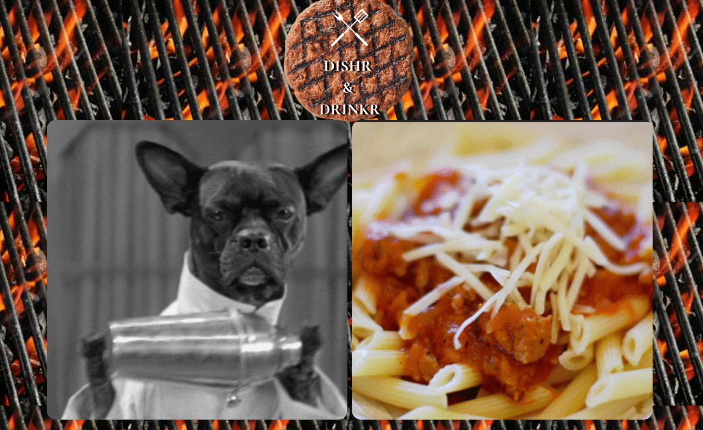

The main problem we see today is people have half-full pantries. but have no clue what to make with all the ingredients on hand
and the same goes for cocktails, we have the stuff to make them, but what do we make? Dishr and Drinkr are here to help!

## Mockup Image




Link to deployed application: https://estevan-gonzales.github.io/project-1-dishr-and-drinkr/

## Description

Dishr & Drinkr's main functionality is to Assist people in finding recipes for the ingredients they have on hand without 20 Google searches for the correct recipe!

## Getting Started

To Get Started Click on either GIF / Image and input the ingredients for either or, and it will display recipes matching the ingredients the user has inputted as well as drop-down menus to select through the categories of food/drink and area.

## Help

```
If you run into issues, please inform us on our issues tab of our repository.
```

## Authors
Estevan Gonzales - (https://github.com/Estevan-Gonzales)  

Emmanuel Exiga - (https://github.com/aPersonIsHere)  

Jessica Linex - (https://github.com/jlinex)  

Kelly Boyd - (https://github.com/kboyd2002) 

## Technology Used

CSS Framework - Bulma (https://bulma.io/documentation/)

Jquery - (https://api.jquery.com/)

Jquery UI - (https://api.jqueryui.com/)

TheMealDB - (https://www.themealdb.com/api.php)

TheCocktailDB - (https://www.thecocktaildb.com/api.php)

## License

MIT License

## Acknowledgments
Unsplash - (https://unsplash.com/) --- Images source

